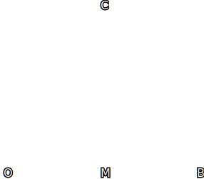

# A Geometrical Approach

Consider this figure. We need to find the coordinates of all points `[A-G]` along with others in terms of `r` (the radius of circle `O`). To make the process easier, let's assume the center of the circle (point `O`) is at `(0,0)`

    
tl;dr spoiler

$$\begin{align*}
A&=(0,r)\\
B&=(r,0)\\
C&=\left(\frac r2,\frac{\sqrt3}2r\right)\\
D&=\left(\frac r2,-\frac{\sqrt3}2r\right)\\
E&=\left(\frac{2r}{5+\sqrt5},\frac r{\sqrt5}\right)\\
F&=\left(-\sqrt{\frac{5-\sqrt5}8}r,\frac{\sqrt5+1}4r\right)\\
G&=\left(-\frac{\sqrt3}2r,\frac r2\right)
\end{align*}$$

## A and B
$$\begin{align*}
&\because r=|OA|=|OB|\\
&\because A=(0,|OA|)\quad B=(|OB|,0)\\
&\therefore A=(0,r)\quad B=(r,0)
\end{align*}$$

## C and D

$$\begin{align*}
&\because|BO|=|BC|=|CO|\\
&\therefore|MO|=\frac{|BO|}2=\frac r2\\
\\
&\because CM\perp MO\\
&\therefore|CM|=\sqrt{|CO|^2-|MO|^2}=\sqrt{r^2-\frac{r^2}4}=\frac{\sqrt3}2r\\
\\
&\because C=(|MO|,|CM|)\quad D=(|MO|,-|CM|)\\
&\therefore C=\left(\frac r2,\frac{\sqrt3}2r\right)\quad D=\left(\frac r2,-\frac{\sqrt3}2r\right)
\end{align*}$$

## E

$$\begin{align*}
&\because|AO|=r\quad |MO|=\frac r2\quad AO\perp MO\\
&\therefore|AM|=\sqrt{|AO|^2+|MO|^2}=\sqrt{r^2+\frac{r^2}4}=\frac{\sqrt5}2r\\
\\
&\because|EM|=|MO|=\frac r2\quad \triangle AOM\sim\triangle ENM\\
&\therefore\frac{|EN|}{|EM|}=\frac{|EN|}{r/2}=\frac{|AO|}{|AM|}=\frac r{(\sqrt5/2)r}=\frac2{\sqrt5}\\
&\therefore|EN|=\frac2{\sqrt5}|EM|=\frac r{\sqrt 5}\\
\\
&\because MN\perp EN\\
&\therefore|MN|=\sqrt{|EM|^2-|EN|^2}=\sqrt{\frac{r^2}4-\frac{r^2}5}=\frac r{2\sqrt5}\\
&\therefore|NO|=|MO|-|MN|=\frac r2-\frac r{2\sqrt5}=\frac{\sqrt5-1}{2\sqrt5}r=\frac{2r}{5+\sqrt5}\\
&\therefore E=(|NO|,|EN|)=\left(\frac{2r}{5+\sqrt5},\frac r{\sqrt5}\right)
\end{align*}$$

(we also need to find $|AE|$ for point $F$)

$$|AE|=|AM|-|EM|=\frac{\sqrt5}2r-\frac12r=\frac{\sqrt5-1}2r=|AF|$$

## F

$$\begin{align*}
&\because|FO|=|AO|\\
&\therefore|AH|=\frac{|AF|}2=\frac{\sqrt5-1}4r\\
&\therefore|OH|=\sqrt{r^2-|AH|^2}=\sqrt{1-\frac{3-\sqrt5}8r}=\sqrt{\frac{5+\sqrt5}8}r\\
\\
&\because|AF||OH|=|AO||FI|=2A_{\triangle AFO}\\
&\therefore|FI|=\frac{|AF|}{|AO|}|OH|=\frac{\sqrt5-1}2\sqrt{\frac{5+\sqrt5}8}=\frac{\sqrt{(\sqrt5-1)^2(5+\sqrt5)}}{2\sqrt8}=\sqrt{\frac{5-\sqrt5}8}r\\
&\therefore|IO|=\sqrt{|FO|^2-|FI|^2}=\sqrt{1-\frac{5-\sqrt5}8r}=\frac{\sqrt5+1}4r\\
&\therefore F=(-|FI|,|IO|)=\left(-\sqrt{\frac{5-\sqrt5}8}r,\frac{\sqrt5+1}4r\right)
\end{align*}$$

<blockquote>

Proof of $\sqrt{1-\frac{5-\sqrt5}8}=\frac{\sqrt5+1}4$ is trivial and left as an exercise to the reader.

spoiler

$$\sqrt{1-\frac{5-\sqrt5}8}=\sqrt{\frac{3+\sqrt5}8}=\sqrt{\frac{6+2\sqrt5}{16}}=\sqrt{\frac{5+2\sqrt5+1}{16}}=\sqrt{\frac{(\sqrt5+1)^2}{16}}=\frac{\sqrt5+1}4$$

</blockquote>

## G

$$\begin{align*}
&\because|AO|=|AG|=|GO|\\
&\therefore|PO|=\frac{|AO|}2=\frac r2\\
&\therefore|GP|=\sqrt{|GO|^2-|PO|^2}=\sqrt{1-\frac14}r=\frac{\sqrt3}3r\\
&\therefore G=(-|GP|,|PO|)=\left(-\frac{\sqrt3}2r,\frac r2\right)
\end{align*}$$

# An Algebraic Approach
This is a zoomed-in view of the arc `FG`. Because we are considering the stroke widths, we need to find the 4 intersections.
Let the stroke width of the center circle be `2c` and the others, `2s`. 

$$\begin{align*}
\text{let }r_1=|AF|+s&=\frac{\\\sqrt5-1}2r+s\\
(1)\quad x^2+y^2&=(r-c)^2\\
(2)\quad x^2+y^2&=(r+c)^2\\
(3)\quad x^2+(y-r)^2&=r_1^2\\
(4)\quad x^2+(y-r)^2&=(r-s)^2\\
\\
(1)-(3)\text{ gives }y^2-(y-r)^2&=(r-c)^2-r_1^2\\
2yr-r^2&=r^2+c^2-r_1^2-2rc\\
2yr&=2r^r+c^2-r_1^2-2rc\\
y&=r+\frac{(c-r_1)(c+r_1)}{2r}-c=y_1\\
(2)-(3)\text{ gives }y^2-(y-r)^2&=(r+c)^2-r_1^2\\
2yr&=2r^2+c^2-r_1^2+2rc\\
y&=r+\frac{(c-r_1)(c+r_1)}{2r}+c=y_2\\
(2)-(4)\text{ gives }y^2-(y-r)^2&=(r+c)^2-(r-s)^2\\
2yr&=r^2+c^2-s^2+2rs+2rc\\
y&=\frac r2+\frac{(c-s)(c+s)}{2r}+s+c=y_3\\
(1)-(4)\text{ gives }y^2-(y-r)^2&=(r-c)^2-(r-s)^2\\
2yr&=r^2+c^2-s^2+2rs-2rc\\
y&=\frac r2+\frac{(c-s)(c+s)}{2r}+s-c=y_3\\
\\
\therefore\text{let }c_1&=r+\frac{(c-r_1)(c+r_1)}{2r}\\
c_2&=\frac r2+\frac{(c-s)(c+s)}{2r}+s\\
&\begin{cases}
y_1=c_1-c\\
y_2=c_1+c\\
y_3=c_2+c\\
y_4=c_2-c\\
\end{cases}
\end{align*}$$

then it's easy to find the $x_i$ of each point using $y_i$
